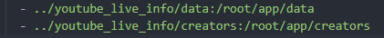
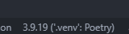

# 環境構築
1. リポジトリをcloneする
2. Jsonのdumpを配置する  
ymlの下記箇所を適宜変更すること

3. リポジトリrootで「docker-compose up -d --build」
4. コンテナ内へ入る  
devcontainerの「実行中のコンテナにアタッチ」で接続
5. /root/app内で「poetry install」を実行
6. インタプリタがpoetryのvenvになっていないのであれば設定する。  

## 起動
poetry run python3 main.py